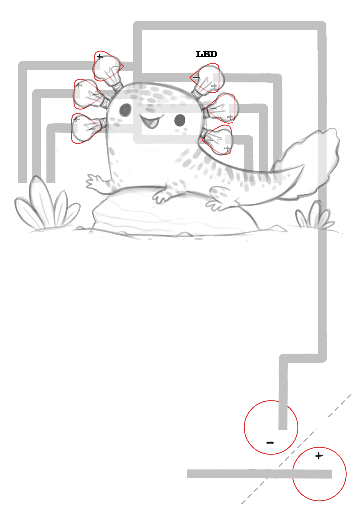

# Chibitronics_Logic_Gates
This repository contains some templates to create circuits with stickers for teenagers and understand the concept of logic gates in a funny way.

<ul>
  <li> Simple Switch</li>
  <li> AND Gate</li>
  <li> OR Gate</li>
  <li> NOT Gate</li>
  <li> NAND Gate</li>
  <li> NOR Gate</li>
  <li> XOR Gate</li>
  <li> XNOR Gate</li>
  <li> Xtras</li>
  <ul>
    <li> Tandem Gate</li>
    <li> Your Own Logic Gate</li>
  </ul>
</ul>

  
  
  
  

  
  
  
  

  
  

