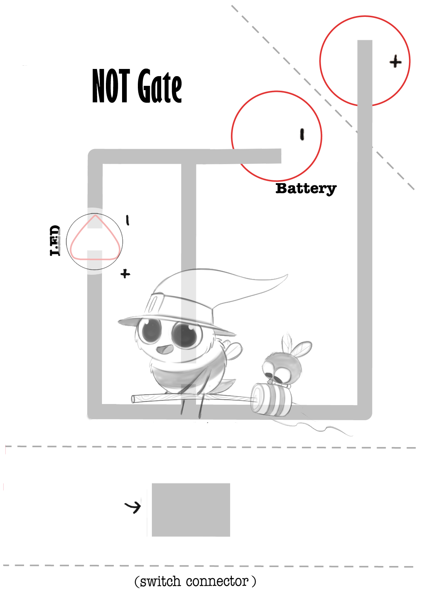
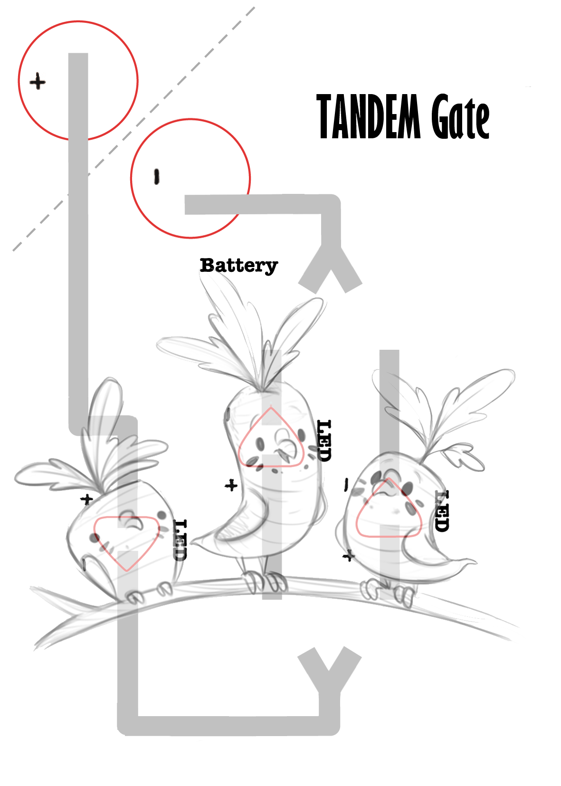

# Chibitronics_Logic_Gates
This repository contains some templates to create circuits with stickers for teenagers and understand the concept of logic gates in a funny way.

You will need only some LED Stickers and copper tape and two 3.3V button battery.
Print the template you need from <b>LogicGates_templates</b> folder and bend dash lines.

<b>*ATENTION:</b> If you want switch on two or more LEDs stickers, you will need two battery cells to work with.

<h2> Simple Gates</h2>
<ul>
  <li> Simple Switch</li>
  <li> AND Gate</li>
  <li> OR Gate</li>
  <li> NOT Gate</li>
</ul>
 

  
  
  
  

 

<h2> Advanced Gates</h2>
<ul>
  <li> NAND Gate</li>
  <li> NOR Gate</li>
  <li> XOR Gate</li>
  <li> XNOR Gate</li>
</ul>

  
  
  
  

 

<h2> Xtras</h2>
  <ul>
    <li> Tandem Gate</li>
    <li> Your Own Logic Gate - Create your own circuit based on logic gates with 6 LED Stickers combinations</li>
  </ul>
 

  
  

This work is based on <a href="https://chibitronics.com/">Chibitronics</a> idea to create circuits with LED stickers and copper tape on a paper and illustrations art of <a href="http://www.piperthibodeau.com/">Piper Thibodeau </a>.

Become a <a href="https://www.patreon.com">patron</a> of <a href="https://www.patreon.com/piperdraws">Piper</a>.

More information in <a href="http://blascarr.com/chibitronics-logic-gates/">Blascarr</a> Webpage.

